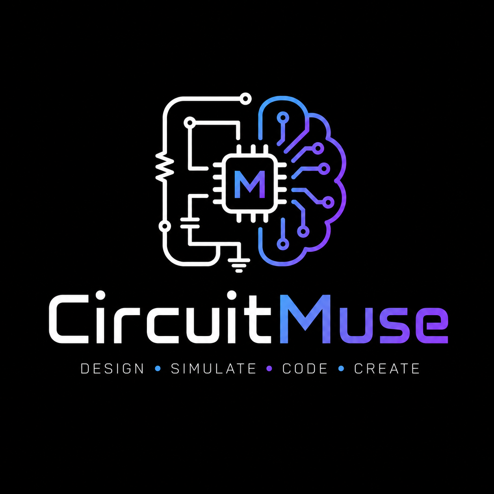

# CircuitMuse

<p align="center">
  
</p>

<p align="center">
  <strong>Design. Simulate. Code. Create.</strong>
</p>

<p align="center">
  <a href="https://github.com/meshackbahati/circuit-muse/releases"></a>
  <a href="https://github.com/meshackbahati/circuit-muse/blob/main/LICENSE"></a>
  <a href="https://github.com/meshackbahati/circuit-muse/actions"></a>
  <a href="https://github.com/meshackbahati/circuit-muse/releases/latest"></a>
  <a href="https://github.com/meshackbahati/circuit-muse/releases"></a>
</p>

<p align="center">
  AI-powered circuit simulator and embedded board emulator for desktop. Write Arduino C++ or MicroPython, compile it, simulate it with real CPU emulation and 150+ interactive electronic components — and chat with an AI to design circuits, debug code, and wire components.
</p>

---

## What CircuitMuse Does

CircuitMuse is a desktop application that lets you:

- **Write code** for microcontrollers (Arduino C++, MicroPython, ESP-IDF C)
- **Compile it** automatically using bundled toolchains
- **Simulate it** with real CPU emulation (not mocked — actual AVR, RP2040, ESP32, STM32, Raspberry Pi silicon)
- **Build circuits** with 150+ electronic components on a drag-and-drop canvas
- **Chat with AI** to design circuits, place components, wire them up, and debug code

Everything runs locally on your machine. No cloud, no accounts, no internet required after installation.

---

## Supported Boards

| Board | CPU | Simulation Engine |
|-------|-----|-------------------|
| Arduino Uno / Nano / Mega 2560 | ATmega328p / ATmega2560 | avr8js (in-browser) |
| ATtiny85 | ATtiny85 | avr8js (in-browser) |
| Raspberry Pi Pico / Pico W | RP2040 | rp2040js (in-browser) |
| ESP32 DevKit / CAM / Lolin32 | Xtensa LX6 | QEMU (bundled) |
| ESP32-S3 / XIAO ESP32-S3 | Xtensa LX7 | QEMU (bundled) |
| ESP32-C3 / SuperMini | RISC-V RV32IMC | QEMU (bundled) |
| STM32 Blue Pill / Nucleo | ARM Cortex-M3 | QEMU (bundled) |
| Raspberry Pi 3B / 4B / 5 | ARM Cortex-A | QEMU + Linux (bundled) |

**Supported platforms:** Windows (x64), macOS (Intel + Apple Silicon), Linux (x64, Arch, Fedora).

---

## Installation

### Download

Get the latest release for your platform from [GitHub Releases](https://github.com/meshackbahati/circuit-muse/releases):

| Platform | Format | Notes |
|----------|--------|-------|
| **Windows** | `.msi` or `.exe` | Installer with start menu shortcut |
| **macOS** | `.dmg` | Drag to Applications folder |
| **Linux (Ubuntu/Debian)** | `.deb` | `sudo dpkg -i circuit-muse_*.deb` |
| **Linux (Arch)** | `PKGBUILD` | `makepkg -si` |
| **Linux (Fedora)** | `.spec` | `rpmbuild` or convert from AppImage |
| **Linux (Universal)** | `.AppImage` | `chmod +x CircuitMuse_*.AppImage && ./CircuitMuse_*.AppImage` |

> **Linux GPU issues?** If you see a white screen or EGL error, run the bundled wrapper script: `./scripts/circuit-muse.sh` — it forces software rendering for compatibility with all hardware.

### First Launch

1. Double-click the installer or AppImage
2. You'll see the CircuitMuse splash screen with loading status
3. The editor workspace opens directly — no landing page
4. The setup wizard runs automatically on first launch, showing what's installed and what needs downloading

### System Requirements

| Component | Required | Auto-installed |
|-----------|----------|----------------|
| Node.js 20+ | Build only | No |
| Python 3.12+ | Engine | No |
| arduino-cli 1.5+ | Compilation | Yes, bundled |
| ESP-IDF (optional) | ESP32 advanced builds | No |
| Ollama (optional) | Local AI agent | No |

---

## Building from Source

### Prerequisites

- Node.js 20+
- Python 3.12+
- Rust (stable)
- Platform-specific dependencies (see below)

### Linux (Ubuntu/Debian)

```bash
sudo apt install -y \
  libwebkit2gtk-4.1-dev libappindicator3-dev librsvg2-dev \
  patchelf libssl-dev libgtk-3-dev libsoup-3.0-dev \
  libjavascriptcoregtk-4.1-dev libudev-dev
```

### Linux (Arch)

```bash
sudo pacman -S webkit2gtk-4.1 appmenu-gtk-module libappindicator-gtk3 \
  librsvg patchelf openssl gtk3 libsoup3
```

### Linux (Fedora)

```bash
sudo dnf install -y gcc webkit2gtk4.1-devel gtk3-devel libsoup3-devel \
  patchelf openssl-devel
```

### macOS

```bash
xcode-select --install
```

### Windows

Install [Visual Studio Build Tools](https://visualstudio.microsoft.com/visual-cpp-build-tools/) with "Desktop development with C++" workload.

### Build Steps

```bash
git clone https://github.com/meshackbahati/circuit-muse.git
cd circuit-muse

# Install app dependencies
cd app && npm install && cd ..

# Install engine dependencies
cd engine && python -m venv venv && source venv/bin/activate
pip install -r requirements.txt && cd ..

# Download arduino-cli (for compilation)
bash scripts/download-deps.sh

# Install Tauri CLI
cargo install tauri-cli --version "^2"

# Build and run
cd src-tauri && cargo tauri dev
```

The app opens with the editor workspace ready to use.

### Building Release Packages

```bash
cd src-tauri
cargo tauri build
```

Output: `src-tauri/target/release/bundle/` contains platform-specific installers.

---

## AI Agent

The built-in AI agent lets you design circuits using natural language.

### Setup

1. Open the AI Agent panel from the toolbar (hamburger menu or Agent button)
2. Click the gear icon to open settings
3. Configure a provider:

| Provider | Setup |
|----------|-------|
| **Ollama** (recommended for offline) | Install [Ollama](https://ollama.com), run `ollama pull llama3` — no API key needed |
| **OpenAI** | Paste API key from [platform.openai.com](https://platform.openai.com) |
| **Anthropic** | Paste API key from [console.anthropic.com](https://console.anthropic.com) |
| **Google Gemini** | Paste API key from [aistudio.google.com](https://aistudio.google.com) |
| **OpenRouter** | Paste API key from [openrouter.ai](https://openrouter.ai) |
| **Custom** | Any OpenAI-compatible endpoint (LM Studio, vLLM, etc.) |

### What the AI Can Do

- Add boards to the canvas
- Add electronic components (LEDs, resistors, sensors, displays)
- Wire components together
- Write Arduino C++ or MicroPython code
- Compile and run simulations
- Debug compilation errors

Example prompts:
- "Add an Arduino Uno and wire an LED to pin 13"
- "Create a temperature sensor circuit with DHT22 and LCD display"
- "Write a blink sketch for the ESP32"

---

## Project Persistence

### Auto-Save

Projects automatically save to IndexedDB every few seconds. Close and reopen the app — your work is still there.

### Creating Projects

Click the Projects button in the toolbar to:
- Create a new empty project
- Open an existing saved project
- Delete old projects

### Import/Export

**Import formats:**
- `.vlx` — CircuitMuse native format
- `.zip` — Wokwi-compatible (diagram.json + code)
- `.fzz` — Fritzing projects
- `.json` — Raw project data

**Export formats:**
- `.vlx` — Full project snapshot
- `.zip` — Wokwi-compatible bundle
- `.json` — Raw data
- `.html` — Shareable report with boards, components, and code

---

## Component System

150+ electronic components across categories:

- **Passive:** Resistors, capacitors, inductors, potentiometers
- **Active:** Transistors (NPN, PNP, MOSFET), op-amps, voltage regulators
- **Output:** LEDs, NeoPixels, buzzers, servos, motors, relays
- **Input:** Pushbuttons, switches, encoders, joysticks
- **Sensors:** DHT22, HC-SR04, BMP280, MPU6050, photoresistors
- **Displays:** LCD1602, SSD1306 OLED, ePaper, 7-segment, LED bar
- **Logic:** AND, OR, NOT, NAND, NOR, XOR gates, flip-flops, shift registers
- **Communication:** I2C, SPI devices (24LC256, MCP3008, DS3231)

---

## Electrical Simulation

- **ngspice-WASM** — real SPICE analog simulation in the browser
- **Mixed-mode** — digital MCU + analog circuits simulated together
- **Instruments:** Voltmeter, ammeter, oscilloscope, function generator
- **44+ SPICE component models**

---

## Serial Monitor

- Live serial output from simulated boards
- Auto baud-rate detection
- Send data to RX pin
- Multi-UART support on ESP32

---

## Project Structure

```
circuit-muse/
├── app/                     # Application layer (React + Vite + TypeScript)
│   ├── src/agent/           # AI agent (providers, tools, chat UI)
│   ├── src/components/      # Editor, simulator canvas, modals
│   ├── src/simulation/      # CPU emulation bridges
│   ├── src/store/           # Zustand state stores
│   ├── src/services/        # API clients, project persistence
│   └── src/desktop/         # Tauri desktop integration
├── engine/                  # Simulation engine (FastAPI + Python)
│   └── app/api/routes/      # compile, agent, libraries, simulation
├── src-tauri/               # Desktop shell (Rust + Tauri)
│   ├── src/commands/        # Serial, debug, QEMU commands
│   └── icons/               # App icons
└── scripts/                 # Build helpers
```

---

## Troubleshooting

### App shows white screen on Linux

The app uses software rendering for compatibility. If you still see issues:

```bash
# Force software rendering
LIBGL_ALWAYS_SOFTWARE=1 ./CircuitMuse_*.AppImage
```

### "arduino-cli not found"

Run the setup wizard (gear icon in toolbar) or manually install:
```bash
bash scripts/download-deps.sh
```

### Engine not starting

The Python engine auto-starts on launch. If it fails:
1. Check Python 3.12+ is installed
2. Run `cd engine && pip install -r requirements.txt`
3. Restart the app

### QEMU boards not working

ESP32/STM32/Raspberry Pi boards need QEMU runtimes. The app auto-downloads them on first use via the setup wizard.

---

## License

MIT License

---

## Author

Meshack Bahati Ouma

---

## Acknowledgments

Based on [Velxio](https://github.com/davidmonterocrespo24/velxio) by David Montero Crespo. Built on [avr8js](https://github.com/wokwi/avr8js), [rp2040js](https://github.com/wokwi/rp2040js), [wokwi-elements](https://github.com/wokwi/wokwi-elements), [ngspice-wasm](https://github.com/wokwi/ngspice-wasm), [lcgamboa/qemu](https://github.com/lcgamboa/qemu), [Espressif QEMU](https://github.com/espressif/qemu), [Tauri](https://tauri.app), and [Monaco Editor](https://microsoft.github.io/monaco-editor/).
